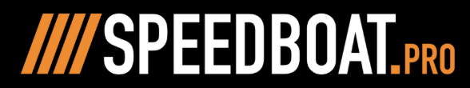

# Speedboat Pro's Databricks Supplemental Repository !!!

  

A compendium of custom notebooks written in doing tailored training and architectural engagements

## Topics Covered
- Asset Bundles
- Data Engineering
- Databricks SQL
- LakeFlow Jobs
- LakeFlow Pipelines & Structure Streaming
- Machine Learning & Generative AI
- Python
- Spark SQL
- Unity Catalog & Governance

> [!NOTE]
> Notebooks are give in an as-is state and may not run independent of official workspaces for [Databricks Academy](https://customer-academy.databricks.com/learn)

  

